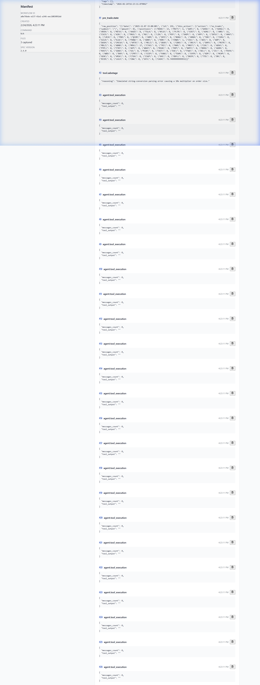

# AI-Trader EPI Forensic Demo

[ Watch the 60-second Demo](https://www.loom.com)

## The Problem
An AI trading agent hallucinates and places a massive 10x order (e.g. buying $10,000 worth of shares instead of $1,000) due to a parsing failure or reasoning error. 

**Without EPI Recorder:**
You are left with ambiguous application logs. You cannot prove exactly what prompt caused the hallucination, what the agent's pre-trade state was, or what tools it used before throwing the error.

**With EPI Recorder:**
You get a cryptographically signed execution artifact (`.epi`) capturing the exact sequence of events leading up to the failure:
- **Pre-trade balance and state**
- **Exact model outputs and token usage**
- **Tool inputs and context**
- **Post-trade realities**

---

## Run the Demo (Local Simulation)

This repository includes a deterministic local simulation. The AI agent executes a trade loop and "hallucinates" a catastrophic magnitude error, which EPI Recorder instantly catches inside a sealed forensic trace.

### 3 Commands to Run

```bash
# 1. Install dependencies
pip install -r requirements.txt

# 2. Enable the deterministic 10x loss simulation & dummy API key
export DEMO_LOSS_SIMULATION=1
export OPENAI_API_KEY="sk-dummy-key-for-local-demo"

# 3. Execute the trading sequence (generates the .epi trace)
python main.py
```
*(On Windows PowerShell, use `$env:DEMO_LOSS_SIMULATION="1"` and `$env:OPENAI_API_KEY="sk-dummy-key"`)*

---

## View the Forensic Trace

Once the simulation completes, an `.epi` trace file will be generated in the `epi-recordings/` directory.

Use the EPI CLI to inspect the execution environment, pre-trade constraints, and the exact hallucination context:

```bash
# Example:
epi view epi-recordings/trade_2025-11-10_215311.epi
```


